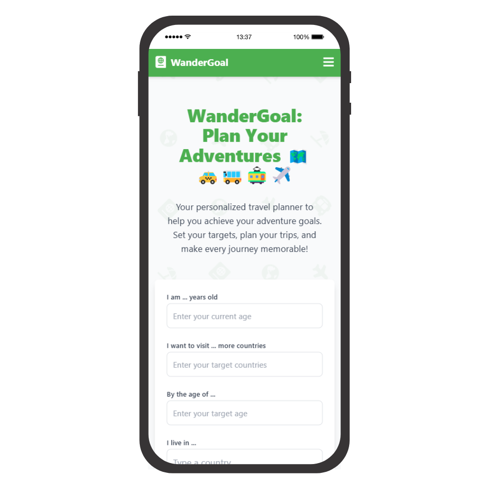

# **WanderGoal** 🗺️

WanderGoal is a travel planning web application designed to help users set, track, and achieve their travel goals. Whether you're aiming to visit a specific number of countries or planning your dream trip, WanderGoal provides an intuitive and interactive way to organize and manage your travel experiences.

### **Features** ✨

- **Personalized Travel Goals** – Set travel targets based on age, location, and desired destinations.
- **Downloadable Travel Plans** – Export your plans in a TXT format for offline access.
- **Interactive & Responsive UI** – Enjoy a seamless experience on desktop and mobile.
- **Secure & Private** – Your travel data is stored securely and accessible only to you.

### **Snapshots** 📷

